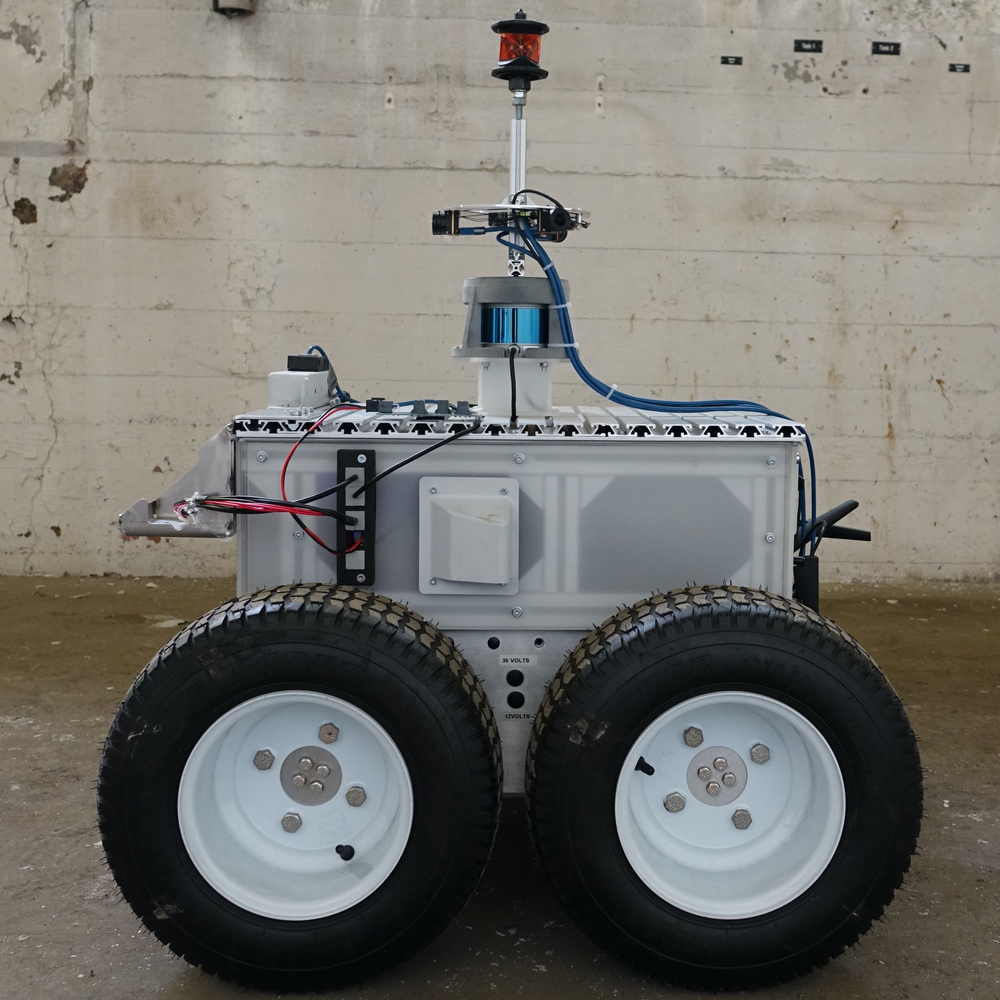

# pickelhaube: 360 deg, calibrated LiDAR + Camera setup



**Record Raw Sensor Data**
```
roslaunch pickelhaube pickelhaube_recording.launch
```

**Replay Sensor Data + Calibrations**
```
roslaunch pickelhaube pickelhaube_from_bag.launch rate:=<replay speed> rosbag:=<path to rosbag>
```
Yields:

- /rslidar_points
- /versavis/imu
- /versavis/cam0/image_raw
- /versavis/cam1/image_raw
- /versavis/cam2/image_raw
- /pickelhaube/cam0/image  (undistorted)
- /pickelhaube/cam1/image  (undistorted)
- /pickelhaube/cam2/image  (undistorted)
- /pickelhaube_resized/cam0/image  (undistorted, cropped, downsampled)
- /pickelhaube_resized/cam1/image  (undistorted, cropped, downsampled)
- /pickelhaube_resized/cam2/image  (undistorted, cropped, downsampled)

Cropping removes those lower of the image where the SMB is visible.
